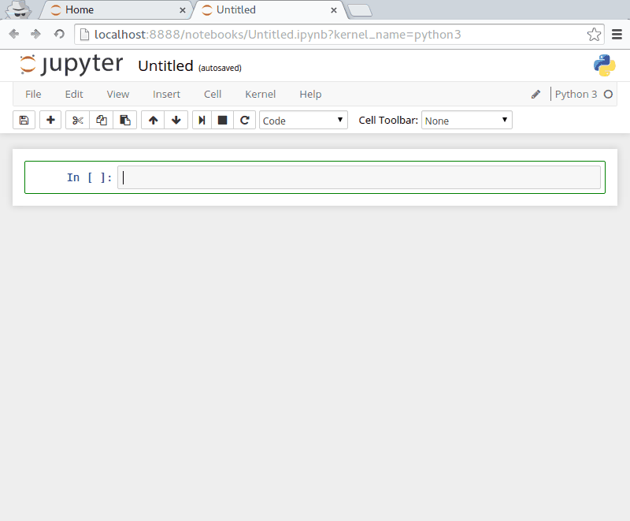
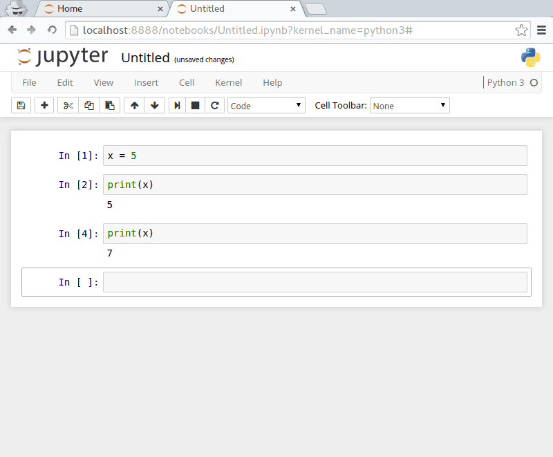
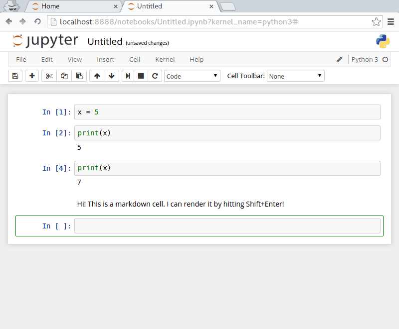
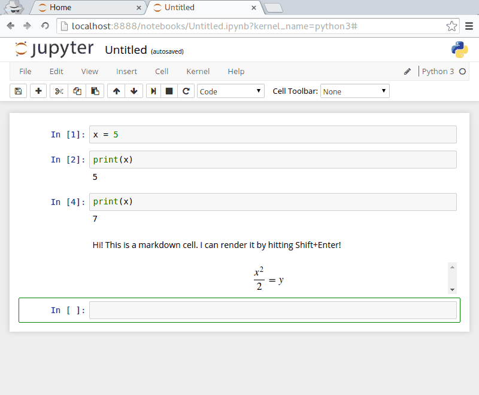

# Введение в Jupyter notebooks 
## Что такое Jupyter Notebook?

В этом курсе мы будем интенсивно использовать [Jupyter Notebooks](https://jupyter-notebook.readthedocs.org/en/latest/notebook. html) (ранее это всё называлось IPython Notebooks). Ноутбуки это мультимедийные документы, в которых можно использовать текст в формате Markdown, математические формулы, набранные в  MathJax, и исполняемый код Python.

Лучший способ понять, что такое ноутбук Jupyter -- попробовать, как это все работает, так что вперед! 

## Запуск сервера нуотбуков
Для запуска сервера ноутбуков откройте терминал и введите

```Bash jupyter notebook ```

Эта команда запустит сервер ноутбуков. После этого в браузере по умолчанию *должна* автоматически открыться заглавная страница сервера. Если этого не произошло, просто откройте браузер и введите в адресной строке 

``` http://localhost:8888/tree ```

На заглавной странице отображается файловая структура директории, из которой был запущен сервер. Для того, чтобы создать свой первый ноутбук, кликните на кнопку `New Notebook`, а затем выберите пункт меню **Python 3** в самом низу списка.


##Выполнение ячейки кода

Под панелью инструментов расположена ячейка кода, начинающаяся с префикса `In [ ]:`. Такая ячейка может содержать произвольный кусок кода, но мы начнем с чего-нибудь простого. В единственной (пока) ячейке наберите

```Python x = 5 ```,

а затем нажмите *Shift+Enter*. Если вы нажмете просто Enter, то обнаружите, что в ячейке просто появилась еще одна строка. Итак, запомните: для того, чтобы **выполнить** команды, содержащиеся в ячейке кода, необходимо нажать *Shift+Enter*.

Что же произошло? Мы приписали ярлык 'x' числу 5. Кроме того, как можно увидеть, префикс самой ячейки изменился и теперь выглядит как `In[1]:`, так как это первое выражение, выполненное данным ядром Python. Также можно заметить, что в ноутбуке появилась новая ячейка, поскольку единственная сущестоввавшая до этого уже использована нами. 

В новой ячейке
In this new cell, let's try to print out the value we assigned to x, so enter


```Python print(x) ```

and then hit **Shift+Enter**.  And there's the output we expect!  The cell gets labeled `In[2]:` and the output of that command is printed immediately below the cell.

The whole procedure should look something like this:



##The Kernel
Don't worry too much about what the "kernel" is, but the main point to remember here is that we can assign a variable in one cell but still access it in a separate cell.  The cells are ways for *us* to divide up our thoughts and our code, but everything is connected underneath.

##Overwriting variables 

Since each cell is interacting with the same Python instance, if we give `x` a new value and then enter `print(x)` we'll get that new value. That's pretty straight forward —but what if we then delete the cell where we gave `x` a new value?

Let's take a look!


Even though we deleted the cell where we assigned `x = 7`, the assignment is still valid.  In fact, the assignment will remain valid until we explicitly execute a cell that sets x equal to a new value, or until we completely restart this Jupyter Notebook instance.

##Markdown 
Markdown is a *writing format* that makes it easy to type well-formatted text that is rendered into properly formatted XHTML.  It's seriously awesome.  Cells in Jupyter notebooks can be used for many things: to run Python, to embed media, or to write text in Markdown.  This allows us to write notes about what we're doing, what the code is doing, what we're *trying* to do, whatever we like! These notes can be for ourselves, to document our work, or to share with others.

To create a Markdown cell in a notebook, click on an empty cell, then click on the Dropdown list (by default, it will say "Code") and select "Markdown"—as shown below.

Markdown is also (sort of) code, so after you type some text, you will also hit *Shift+Enter* to execute the cell and render the Markdown text. Try it out!  Just type out a sentence or two in a markdown cell, then hit *Shift+Enter* to render the text.



##Markdown Math ## 
Markdown can do more than just render simple text, it can also render LaTeX-style equations using **MathJax**!

* For inline math, wrap LaTeX inside single `$` signs `$...$` * For single-line rendering, wrap LaTeX inside double `$$` signs `$$...$$`



**Note:**

Be aware that math typesetting is handled by MathJax and not by LaTeX. While the vast majority of MathJax syntax is identical to LaTeX, there are a few small differences (especially when it comes to matrix commands).  So if you find something doesn't typeset the way you expect, Google around to make sure you're using the correct command.

##More Markdown Syntax 
There are several references to learn Markdown tricks, but we especially like the summary by [John Gruber](http://daringfireball.net/projects/markdown/syntax).  A few features that we find particularly useful are listed below.

For italics, wrap text in single `*`: `*this will be italic*` For bold, wrap text in double `**`: `**this will be bold**` For a bulleted list, start the line with an `*`, then type a space followed by the bullet item ``` * list item * another list item * and another ```

##Moving Cells Around
You'll often find that you want to add or delete cells, or just move them around.  To move a cell, just click on it to select it, then use the Up- and Down-arrows in the toolbar to change the position of the cell.



To add a cell, you can click the + button in the toolbar.  Once you're comfortable with the notebook layout, you can also click on Help -> Keyboard Shortcuts to find out various shortcuts for adding, deleting and managing cell position and type.
